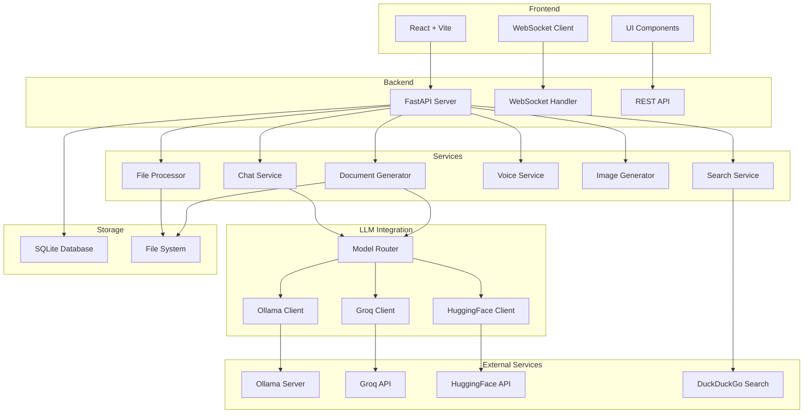
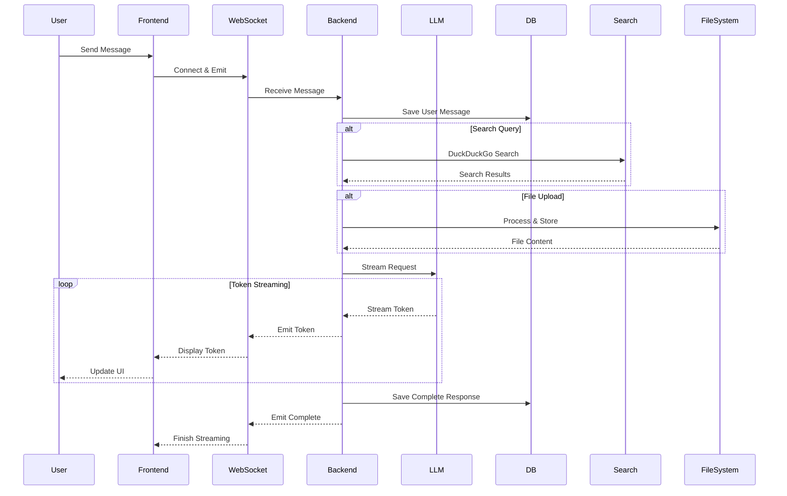
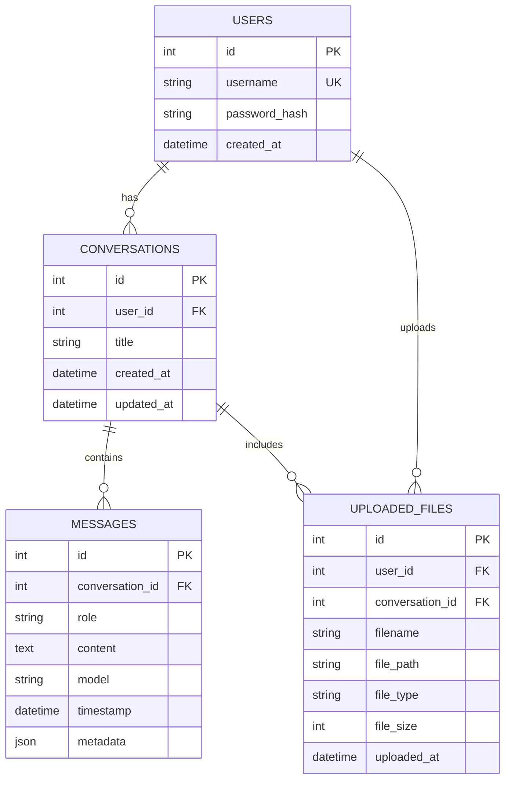

# NexusAI - AI-Powered Chatbot

A modern, full-stack AI chatbot application featuring multiple LLM integrations, real-time streaming, document generation, file processing, voice interactions, and image generation. Built with React, FastAPI, and WebSocket for seamless real-time communication.

## Architecture



## Data Flow



## Database Schema



## Features

| Feature | Description | Technology |
|---------|-------------|------------|
| **Multi-LLM Support** | Connect to Ollama, Groq, and HuggingFace models | FastAPI, Python Clients |
| **Real-time Streaming** | Live token streaming with WebSocket | WebSocket, Socket.IO |
| **Document Generation** | Create Word/PDF documents from conversations | python-docx, reportlab |
| **File Processing** | Upload and analyze various file types | python-magic, PyPDF2 |
| **Voice Interactions** | Text-to-speech and speech-to-text | pyttsx3, SpeechRecognition |
| **Image Generation** | Generate images from text prompts | HuggingFace Diffusion Models |
| **Web Search** | Integrate real-time web search results | DuckDuckGo API |
| **Conversation History** | Persistent chat history with SQLite | SQLAlchemy ORM |
| **User Authentication** | Secure login with JWT tokens | FastAPI Security, JWT |
| **Model Switching** | Switch between models mid-conversation | Dynamic Routing |
| **Code Highlighting** | Syntax highlighting for code blocks | React Markdown, Prism |
| **Markdown Support** | Rich text formatting in messages | react-markdown |
| **File Attachments** | Attach files to messages | Multipart Upload |
| **Export Conversations** | Download chats as documents | Document Service |
| **Responsive Design** | Mobile-friendly interface | CSS Flexbox/Grid |

## Tech Stack

### Backend

| Package | Version | Purpose |
|---------|---------|---------|
| `fastapi` | ^0.104.0 | Web framework |
| `uvicorn` | ^0.24.0 | ASGI server |
| `python-socketio` | ^5.10.0 | WebSocket support |
| `sqlalchemy` | ^2.0.0 | ORM |
| `pydantic` | ^2.5.0 | Data validation |
| `python-jose` | ^3.3.0 | JWT authentication |
| `passlib` | ^1.7.4 | Password hashing |
| `ollama` | ^0.1.0 | Ollama client |
| `groq` | ^0.4.0 | Groq client |
| `huggingface-hub` | ^0.19.0 | HuggingFace client |
| `python-docx` | ^1.1.0 | Word document generation |
| `reportlab` | ^4.0.0 | PDF generation |
| `python-magic` | ^0.4.27 | File type detection |
| `PyPDF2` | ^3.0.0 | PDF processing |
| `pyttsx3` | ^2.90 | Text-to-speech |
| `SpeechRecognition` | ^3.10.0 | Speech-to-text |
| `duckduckgo-search` | ^3.9.0 | Web search |
| `python-multipart` | ^0.0.6 | File uploads |

### Frontend

| Package | Version | Purpose |
|---------|---------|---------|
| `react` | ^18.2.0 | UI framework |
| `vite` | ^5.0.0 | Build tool |
| `socket.io-client` | ^4.7.0 | WebSocket client |
| `axios` | ^1.6.0 | HTTP client |
| `react-markdown` | ^9.0.0 | Markdown rendering |
| `react-syntax-highlighter` | ^15.5.0 | Code highlighting |
| `lucide-react` | ^0.300.0 | Icons |
| `tailwindcss` | ^3.4.0 | Styling |

## Prerequisites

| Requirement | Version | Purpose |
|-------------|---------|---------|
| **Python** | 3.9+ | Backend runtime |
| **Node.js** | 18+ | Frontend development |
| **Git** | Latest | Version control |
| **FFmpeg** | Latest | Audio processing |
| **Ollama** | Latest | Local LLM server |
| **API Keys** | - | Groq & HuggingFace access |

## Installation

### 1. Clone or Create Project

```bash
# Create project directory
mkdir ai-chatbot
cd ai-chatbot
```

### 2. Backend Setup

```bash
# Create backend directory
mkdir backend
cd backend

# Create virtual environment
python -m venv venv

# Activate virtual environment
# Windows:
venv\Scripts\activate
# macOS/Linux:
source venv/bin/activate

# Install dependencies
pip install fastapi uvicorn python-socketio sqlalchemy pydantic python-jose passlib bcrypt ollama groq huggingface-hub python-docx reportlab python-magic PyPDF2 pyttsx3 SpeechRecognition duckduckgo-search python-multipart

# Create .env file
# See Environment Variables section below
```

### 3. Frontend Setup

```bash
# Navigate to project root
cd ..

# Create frontend with Vite
npm create vite@latest frontend -- --template react
cd frontend

# Install dependencies
npm install socket.io-client axios react-markdown react-syntax-highlighter lucide-react
npm install -D tailwindcss postcss autoprefixer
npx tailwindcss init -p
```

### 4. Install Ollama Models

```bash
# Install Ollama from https://ollama.ai
# Then pull recommended models:
ollama pull llama2
ollama pull codellama
ollama pull mistral
```

### 5. Run the Application

**Terminal 1 - Backend:**
```bash
cd backend
venv\Scripts\activate  # or source venv/bin/activate
uvicorn main:app --reload --host 0.0.0.0 --port 8000
```

**Terminal 2 - Frontend:**
```bash
cd frontend
npm run dev
```

### 6. First-Time Setup

1. Open browser to `http://localhost:5173`
2. Register a new user account
3. Configure your preferred LLM provider in settings
4. Add API keys for Groq/HuggingFace if using cloud models
5. Start chatting!

## API Endpoints

### Authentication

| Method | Endpoint | Description |
|--------|----------|-------------|
| `POST` | `/api/auth/register` | Register new user |
| `POST` | `/api/auth/login` | Login and get JWT token |
| `GET` | `/api/auth/me` | Get current user info |

### Chat

| Method | Endpoint | Description |
|--------|----------|-------------|
| `GET` | `/api/conversations` | List all conversations |
| `POST` | `/api/conversations` | Create new conversation |
| `GET` | `/api/conversations/{id}` | Get conversation details |
| `DELETE` | `/api/conversations/{id}` | Delete conversation |
| `GET` | `/api/conversations/{id}/messages` | Get conversation messages |
| `WS` | `/ws/{conversation_id}` | WebSocket for real-time chat |

### Models

| Method | Endpoint | Description |
|--------|----------|-------------|
| `GET` | `/api/models` | List available models |
| `GET` | `/api/models/ollama` | List Ollama models |
| `GET` | `/api/models/groq` | List Groq models |
| `GET` | `/api/models/huggingface` | List HuggingFace models |

### Files

| Method | Endpoint | Description |
|--------|----------|-------------|
| `POST` | `/api/files/upload` | Upload file |
| `GET` | `/api/files/{id}` | Download file |
| `DELETE` | `/api/files/{id}` | Delete file |
| `GET` | `/api/files/conversation/{id}` | List conversation files |

### Documents

| Method | Endpoint | Description |
|--------|----------|-------------|
| `POST` | `/api/documents/generate/word` | Generate Word document |
| `POST` | `/api/documents/generate/pdf` | Generate PDF document |
| `GET` | `/api/documents/{id}` | Download generated document |

### Voice

| Method | Endpoint | Description |
|--------|----------|-------------|
| `POST` | `/api/voice/text-to-speech` | Convert text to speech |
| `POST` | `/api/voice/speech-to-text` | Convert speech to text |

## Environment Variables

Create a `.env` file in the `backend` directory:

```env
# Database
DATABASE_URL=sqlite:///./nexusai.db

# Security
SECRET_KEY=your-secret-key-here-generate-with-openssl-rand-hex-32
ALGORITHM=HS256
ACCESS_TOKEN_EXPIRE_MINUTES=30

# Ollama
OLLAMA_BASE_URL=http://localhost:11434
OLLAMA_DEFAULT_MODEL=llama2

# Groq
GROQ_API_KEY=your-groq-api-key-here
GROQ_DEFAULT_MODEL=mixtral-8x7b-32768

# HuggingFace
HUGGINGFACE_API_KEY=your-huggingface-api-key-here
HUGGINGFACE_DEFAULT_MODEL=mistralai/Mistral-7B-Instruct-v0.2

# File Storage
UPLOAD_DIR=./uploads
MAX_UPLOAD_SIZE=10485760  # 10MB in bytes

# Voice
TTS_RATE=150
TTS_VOLUME=0.9

# CORS
CORS_ORIGINS=http://localhost:5173,http://localhost:3000

# WebSocket
WEBSOCKET_PING_INTERVAL=25
WEBSOCKET_PING_TIMEOUT=60
```

## Deployment

### Frontend (Vercel)

```bash
cd frontend
npm run build
vercel deploy --prod
```

### Backend Options

| Platform | Difficulty | Cost | Best For |
|----------|------------|------|----------|
| **Railway** | Easy | Free tier available | Quick deployment |
| **Render** | Easy | Free tier available | Automatic deployments |
| **Fly.io** | Medium | Free tier available | Global edge deployment |
| **Self-hosted** | Hard | Server costs | Full control |

**Railway Deployment:**
```bash
# Install Railway CLI
npm install -g railway

# Login and deploy
railway login
railway init
railway up
```

## Project Structure

```
ai-chatbot/
├── backend/
│   ├── main.py                 # FastAPI application entry
│   ├── database.py             # Database configuration
│   ├── models.py               # SQLAlchemy models
│   ├── schemas.py              # Pydantic schemas
│   ├── auth.py                 # Authentication logic
│   ├── config.py               # Configuration management
│   ├── services/
│   │   ├── chat_service.py     # Chat logic
│   │   ├── document_service.py # Document generation
│   │   ├── file_service.py     # File processing
│   │   ├── voice_service.py    # Voice interactions
│   │   ├── image_service.py    # Image generation
│   │   └── search_service.py   # Web search
│   ├── llm/
│   │   ├── router.py           # Model routing
│   │   ├── ollama_client.py    # Ollama integration
│   │   ├── groq_client.py      # Groq integration
│   │   └── huggingface_client.py # HF integration
│   ├── uploads/                # Uploaded files
│   ├── generated/              # Generated documents
│   ├── requirements.txt        # Python dependencies
│   └── .env                    # Environment variables
├── frontend/
│   ├── src/
│   │   ├── App.jsx             # Main application
│   │   ├── components/
│   │   │   ├── ChatInterface.jsx
│   │   │   ├── MessageList.jsx
│   │   │   ├── MessageInput.jsx
│   │   │   ├── Sidebar.jsx
│   │   │   ├── Settings.jsx
│   │   │   ├── FileUpload.jsx
│   │   │   └── ModelSelector.jsx
│   │   ├── services/
│   │   │   ├── api.js          # API client
│   │   │   └── websocket.js    # WebSocket client
│   │   ├── hooks/
│   │   │   ├── useChat.js
│   │   │   ├── useAuth.js
│   │   │   └── useWebSocket.js
│   │   ├── utils/
│   │   │   ├── formatters.js
│   │   │   └── validators.js
│   │   └── styles/
│   │       └── index.css
│   ├── package.json
│   ├── vite.config.js
│   └── tailwind.config.js
└── README.md
```

## Troubleshooting

| Issue | Cause | Solution |
|-------|-------|----------|
| **WebSocket connection failed** | CORS or port mismatch | Check CORS_ORIGINS in .env matches frontend URL |
| **Ollama models not found** | Ollama not running | Start Ollama: `ollama serve` |
| **File upload fails** | Size limit exceeded | Increase MAX_UPLOAD_SIZE in .env |
| **Voice features not working** | FFmpeg not installed | Install FFmpeg: `apt install ffmpeg` or download from ffmpeg.org |
| **Database locked error** | SQLite concurrency | Consider PostgreSQL for production |
| **API key errors** | Invalid or missing keys | Verify GROQ_API_KEY and HUGGINGFACE_API_KEY in .env |
| **Slow response times** | Large model or slow server | Use smaller models or upgrade server resources |

## Contributing

Contributions are welcome! Please:
1. Fork the repository
2. Create a feature branch (`git checkout -b feature/amazing-feature`)
3. Commit your changes (`git commit -m 'Add amazing feature'`)
4. Push to the branch (`git push origin feature/amazing-feature`)
5. Open a Pull Request

## License

MIT License - See LICENSE file for details

---

**Built with ❤️ using React, FastAPI, and modern AI technologies**
